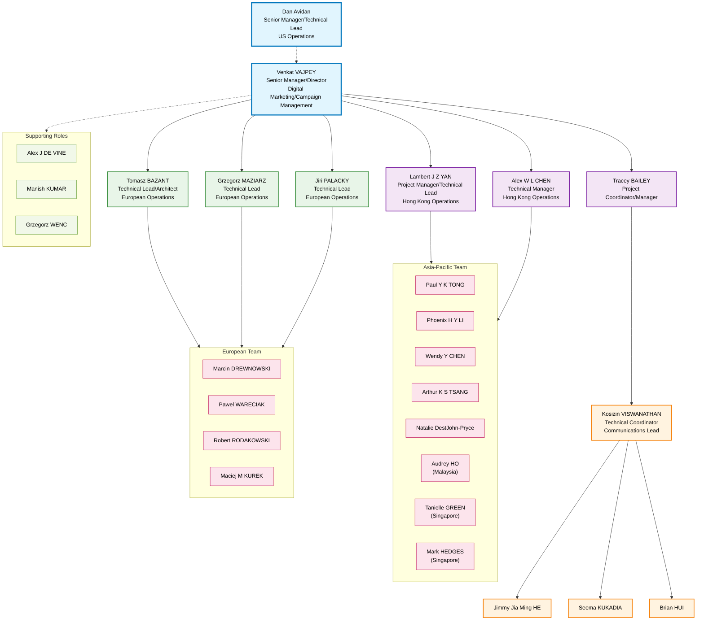

# HSBC AEM & MDP Messages Automation Project - Organizational Chart

## Diagram Explanation

### Hierarchy Structure:
1. **Senior Leadership (Blue)**: Venkat VAJPEY leads the project with Dan Avidan in a senior advisory role
2. **Project Leadership (Purple)**: Direct reports to Venkat handling project coordination and technical management
3. **Technical Leads (Green)**: European operations technical leadership
4. **Implementation Team (Orange)**: Core technical coordination and support
5. **Regional Teams (Pink)**: Asia-Pacific and European operational teams
6. **Supporting Roles (Light Green)**: Additional project support personnel

### Key Relationships:
- Tracey BAILEY and Lambert J Z YAN report directly to Venkat VAJPEY for project coordination
- Regional teams are managed through their respective technical leads and project managers
- Kosizin VISWANATHAN serves as the central communications hub for the implementation team
- European technical leads (Tomasz, Grzegorz, Jiri) manage the European regional team
- Asia-Pacific team reports through Lambert YAN and Alex CHEN

This organizational structure reflects a matrix organization with clear hierarchical reporting while maintaining regional operational focus.